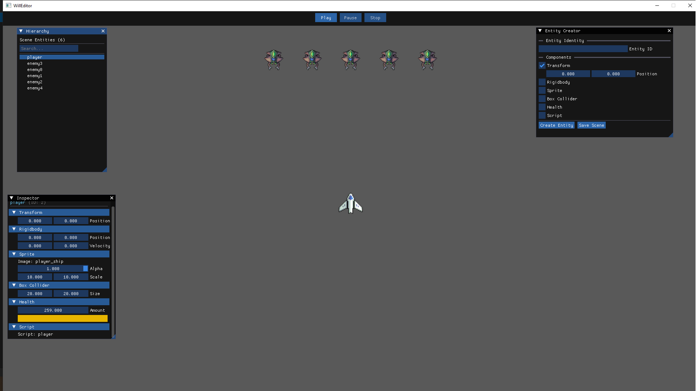

# WillEngine

Hi everyone this is my first attemt to create a game engine, this is not a "serious" engine engine. I've always wanted to learn game technologies so this was my first attempt. Not exactly optimized and finished and it's at the mvp level so that you can use this engine as a sandbox that learn some engine programming stuff in practical way by reading, breaking, repairing and extending it for example you can implement your collision system.

as a technical overview my engine is a data-driven static library and it's being seperated from "game" and games are just data(assets folder). You don't have to compile the engine each time you make changes of assets nevertheless the engine doesn't provide hot reloading in this current state. So it's just a data manipulator that gets it's data from assets folder and by it's subsystems it collides game entities, renders, and play sounds. Also editor is a game as well, it's a game that manipulates assets but i hated it while had been creating my mind is not working as a state machine xd so go ahead and improve it.

For now i don't think i'm gonna improve it further.



*The following document is written by Claude and i edited in order to keep it here for future reference.*


A modern 2D game engine built with C++20, featuring an Entity Component System (ECS) architecture, Lua scripting, WebGPU rendering, and a visual editor powered by ImGui.

## Table of Contents

- [Overview](#overview)
- [Features](#features)
- [Architecture](#architecture)
- [Getting Started](#getting-started)
- [Project Structure](#project-structure)
- [Core Systems](#core-systems)
- [Editor Usage](#editor-usage)
- [Scripting Guide](#scripting-guide)
- [Creating a Game](#creating-a-game)
- [Building and Running](#building-and-running)
- [Examples](#examples)
- [API Reference](#api-reference)

---

## Overview

WillEngine is a component-based 2D game engine designed for rapid prototyping and game development. It separates game logic (via Lua scripts) from engine systems (C++), providing a flexible and extensible framework for 2D games.

### Key Technologies

- **C++20** - Core engine implementation
- **WebGPU** - Modern graphics API for cross-platform rendering
- **Lua 5.4** - Scripting language for game logic
- **GLFW** - Window and input management
- **GLM** - Mathematics library
- **Sol2** - C++/Lua binding library
- **SoLoud** - Audio engine
- **ImGui** - Immediate mode GUI for the editor
- **CMake** - Build system

---

## Features

### Engine Features

- **Entity Component System (ECS)** - Efficient data-oriented architecture
- **Lua Scripting** - Write game logic in Lua with hot-reloading support
- **WebGPU Rendering** - Modern GPU-accelerated 2D sprite rendering with alpha blending
- **Physics System** - Simple physics with collision detection and boundary handling
- **Audio System** - Sound playback with SoLoud
- **Resource Management** - Automatic loading of sprites, sounds, and scripts
- **Event System** - Decoupled communication between systems
- **Scene Management** - Save/load game scenes with full entity serialization

### Editor Features

- **Visual Entity Editor** - Create entities with drag-and-drop component configuration
- **Hierarchy Window** - View and select entities in your scene
- **Inspector Window** - Edit component properties in real-time
- **Play/Pause/Stop Controls** - Test your game with state preservation
- **Scene Persistence** - Save scenes to Lua configuration files
- **Component Modification** - Edit transforms, sprites, physics, health, and more

---

## Architecture

### Entity Component System (ECS)

WillEngine uses a sparse-set based ECS implementation:

```
┌─────────────┐
│   Entity    │  (Just an ID: entityID = long)
└─────────────┘
       │
       ├── Component: Transform (position x, y)
       ├── Component: Sprite (image, alpha, scale)
       ├── Component: Rigidbody (position, velocity)
       ├── Component: BoxCollider (dimensions)
       ├── Component: Health (percent)
       └── Component: Script (name)
```

**Key Concepts:**
- **Entity** - A unique ID representing a game object
- **Component** - Pure data (no behavior)
- **System** - Logic that operates on entities with specific components

### Engine Structure

```
Engine
├── ECS (Entity Component System)
├── GraphicsManager (Rendering)
├── PhysicsManager (Movement & Collisions)
├── InputManager (Keyboard/Mouse)
├── ScriptManager (Lua Integration)
├── SoundManager (Audio)
├── ResourceManager (Assets)
├── SceneManager (Scene Loading/Saving)
└── EventManager (Event Bus)
```

---

## Getting Started

### Prerequisites

- CMake 3.14 or higher
- C++20 compatible compiler (GCC 10+, Clang 11+, MSVC 2019+)
- Git

### Quick Start

1. **Clone the repository**
```bash
git clone <repository-url>
cd willengine
```

2. **Build the project**
```bash
mkdir build
cd build
cmake ..
cmake --build .
```

3. **Run the editor**
```bash
./editor  # or ./run_editor
```

4. **Run a game demo**
```bash
./helloworld  # or ./run_helloworld
```

---

## Project Structure

```
willengine/
├── CMakeLists.txt           # Build configuration
├── src/                     # Engine source code
│   ├── Engine.h/cpp         # Main engine class
│   ├── ECS/                 # Entity Component System
│   ├── GraphicsManager/     # Rendering system
│   ├── PhysicsManager/      # Physics & collision
│   ├── InputManager/        # Input handling
│   ├── ScriptManager/       # Lua integration
│   ├── SoundManager/        # Audio system
│   ├── ResourceManager/     # Asset loading
│   ├── SceneManager/        # Scene management
│   ├── EventManager/        # Event system
│   ├── Events/              # Event definitions
│   └── Types.h              # Common types & components
├── Editor/                  # Visual editor
│   ├── editor.cpp           # Editor entry point
│   ├── App.h/cpp            # Editor application
│   ├── UserInterface/       # ImGui UI
│   ├── EventHandler/        # Editor event handling
│   └── States.h             # Editor state management
├── demo/                    # Example games
│   └── helloworld.cpp       # Minimal game example
└── assets/                  # Game assets
    ├── scripts/             # Lua scripts
    │   ├── config/          # Scene configurations
    │   ├── player.lua       # Player controller
    │   └── enemy.lua        # Enemy AI
    ├── sprites/             # PNG images
    └── sounds/              # WAV audio files
```

---

## Core Systems

### 1. Entity Component System (ECS)

The ECS is the heart of WillEngine's data organization.

#### Creating Entities

**In C++:**
```cpp
entityID player = engine.ecs.Create();
```

**In Lua:**
```lua
local player = ECS.CreateEntity()
```

#### Adding Components

**In C++:**
```cpp
Transform& transform = engine.ecs.Get<Transform>(player);
transform.x = 0.0f;
transform.y = 0.0f;

Sprite& sprite = engine.ecs.Get<Sprite>(player);
sprite.image = "player_ship";
sprite.alpha = 1.0f;
sprite.scale = vec2(10.0f, 10.0f);
```

**In Lua:**
```lua
ECS.AddComponent(player, Transform(vec2(0, 0)))
ECS.AddComponent(player, Sprite("player_ship", 1.0, vec2(10, 10)))
```

#### Querying Entities

```cpp
// Iterate over all entities with Transform and Sprite
engine.ecs.ForEach<Transform, Sprite>([&](entityID entity) {
    Transform& t = engine.ecs.Get<Transform>(entity);
    Sprite& s = engine.ecs.Get<Sprite>(entity);
    
    // Do something with the entity
});
```

#### Available Components

| Component | Purpose | Fields |
|-----------|---------|--------|
| `Transform` | Position in world space | `x`, `y` |
| `Sprite` | Visual representation | `image`, `alpha`, `scale` |
| `Rigidbody` | Physics simulation | `position`, `velocity` |
| `BoxCollider` | Collision detection | `dimensionSizes`, `isCollided` |
| `Health` | Hit points | `percent` |
| `Script` | Lua behavior | `name` |

### 2. Graphics System

WillEngine uses WebGPU for modern, efficient 2D rendering.

#### Features
- Sprite batching for performance
- Alpha blending for transparency
- Automatic aspect ratio scaling
- Z-ordering via alpha channel

#### Loading Textures

```cpp
engine.resource->LoadTexture("player_ship", "sprites/player_ship.png");
```

#### World Coordinates

The engine uses a coordinate system centered at (0, 0) with configurable world bounds:
- Default: -100 to +100 units vertically
- Aspect ratio determines horizontal bounds
- (0, 0) is the center of the screen

### 3. Physics System

Simple physics.

#### Rigidbody Component

```lua
local rb = Rigidbody(vec2(0, 0), vec2(0, 0))  -- position, velocity
ECS.AddComponent(entity, rb)
```

#### Physics Update (automatic)

The physics system:
1. Updates positions based on velocity
2. Syncs Rigidbody position to Transform
3. Checks boundary collisions
4. Stops entities at world bounds

### 4. Script System

Lua scripts define entity behavior with isolated environments per script.

#### Script Structure

Every entity script should have:
```lua
function Start(self)
    -- Called once when the entity is created
    -- Initialize variables here
    self.rb = ECS.GetRigidbody(self.entity)
end

function Update(self)
    -- Called every frame
    -- Game logic goes here
end
```

#### Script Isolation

Each script file runs in its own environment:
- Scripts can't interfere with each other's global variables
- Multiple entities can use the same script safely
- Each entity gets its own `self` table for state

#### Example Player Controller

```lua
function Start(self)
    self.rb = ECS.GetRigidbody(self.entity)
    self.speed = 0.1
    print("Player started for entity: " .. self.entity)
end

function Update(self)
    -- Movement
    if Input.KeyHoldingDown(KEYBOARD.A) then
        self.rb.velocity.x = self.rb.velocity.x - self.speed
    end
    if Input.KeyHoldingDown(KEYBOARD.D) then
        self.rb.velocity.x = self.rb.velocity.x + self.speed
    end
    if Input.KeyHoldingDown(KEYBOARD.W) then
        self.rb.velocity.y = self.rb.velocity.y + self.speed
    end
    if Input.KeyHoldingDown(KEYBOARD.S) then
        self.rb.velocity.y = self.rb.velocity.y - self.speed
    end
    
    -- Shoot on spacebar
    if Input.KeyJustPressed(KEYBOARD.SPACE) then
        Sound.Play("shoot")
    end
end
```

### 5. Sound System

Simple audio playback using SoLoud.

```lua
-- In Lua
Sound.LoadSound("jump", "sounds/jump.wav")
Sound.Play("jump")
```

```cpp
// In C++
engine.resource->LoadSound("jump", "sounds/jump.wav");
engine.sound->PlaySound("jump");
```

### 6. Scene Management

Scenes are defined in Lua configuration files and can be saved/loaded dynamically.

#### Scene File Format (`scene_config.lua`)

```lua
Scene = {
    entities = {
        {
            id = {entityID = "player"},
            components = {
                transform = {x = 0, y = 0},
                rigidbody = {x = 0, y = 0, x_vel = 0, y_vel = 0},
                sprite = {sprite_id = "player_ship", sprite_alpha = 1, width = 10, height = 10},
                box_collider = {width = 20, height = 20, isCollided = false},
                health = {amount = 100},
                script = {name = "player"}
            }
        },
        {
            id = {entityID = "enemy1"},
            components = {
                transform = {x = 20, y = 75},
                rigidbody = {x = 20, y = 75, x_vel = 0, y_vel = 0},
                sprite = {sprite_id = "enemy_ship", sprite_alpha = 1, width = 10, height = 10},
                box_collider = {width = 20, height = 20, isCollided = false},
                health = {amount = 100},
                script = {name = "enemy"}
            }
        }
    }
}
```

#### Loading a Scene

```cpp
engine.scene->CreateGameEntititesWComponents("scripts/config/scene_config.lua");
```

#### Auto-Loading Assets

The engine automatically loads all assets from:
- `assets/scripts/*.lua` - Lua scripts
- `assets/sprites/*.png` - Sprite textures
- `assets/sounds/*.wav` - Audio files

---

## Editor Usage

The WillEngine Editor provides a visual interface for creating and editing game entities.

### Editor Layout

```
┌─────────────────────────────────────────────────┐
│  [Play]  [Pause]  [Stop]  ← Toolbar             │
├───────────────┬──────────────────┬──────────────┤
│               │                  │              │
│  Hierarchy    │  Game View       │  Inspector   │
│  - player     │  (rendered)      │  Transform   │
│  - enemy1     │                  │   x: 0.0     │
│  - enemy2     │                  │   y: 0.0     │
│               │                  │  Rigidbody   │
│               │                  │   vel: 0,0   │
│               │                  │              │
├───────────────┴──────────────────┴──────────────┤
│  Entity Creator                                  │
│  [Entity ID]  [Components]  [Create]  [Save]    │
└─────────────────────────────────────────────────┘
```

### Windows

#### 1. Toolbar
- **Play** - Start the game (runs scripts, enables physics)
- **Pause** - Pause the game (freezes update loop)
- **Stop** - Stop and restore to pre-play state

#### 2. Hierarchy Window
- Lists all entities in the scene
- Click to select an entity
- Shows entity name and ID
- Tooltip shows components on hover

#### 3. Inspector Window
- Edit components of selected entity
- Changes apply immediately
- **Read-only during play mode**

#### 4. Entity Creator Window
- Create new entities with components
- Configure initial values
- Add to scene with "Create Entity" button
- Save entire scene with "Save Scene" button

### Play Mode Behavior

When you click **Play**:
1. A snapshot of all entity states is saved
2. Scripts' `Start()` functions are called
3. Game loop begins (physics + scripts update)

When you click **Stop**:
1. The snapshot is restored
2. All entities return to pre-play state
3. Perfect for testing without losing your work!

### Editing Workflow

1. **Create entities** in the Entity Creator
2. **Select entity** in Hierarchy
3. **Edit components** in Inspector
4. **Test with Play** button
5. **Save scene** when satisfied

---

## Scripting Guide

### Lua API Reference

#### Input Namespace

```lua
-- Check if key is currently held down
Input.KeyHoldingDown(KEYBOARD.W)
Input.KeyHoldingDown(KEYBOARD.A)
Input.KeyHoldingDown(KEYBOARD.S)
Input.KeyHoldingDown(KEYBOARD.D)
Input.KeyHoldingDown(KEYBOARD.SPACE)
Input.KeyHoldingDown(KEYBOARD.ESC)

-- Check if key was just pressed this frame
Input.KeyJustPressed(KEYBOARD.SPACE)

-- Check if key was just released this frame
Input.KeyReleased(KEYBOARD.SPACE)
```

#### ECS Namespace

```lua
-- Create an entity
local entity = ECS.CreateEntity()

-- Add components
ECS.AddComponent(entity, Transform(vec2(x, y)))
ECS.AddComponent(entity, Sprite("image_name", alpha, vec2(width, height)))
ECS.AddComponent(entity, Rigidbody(vec2(x, y), vec2(vel_x, vel_y)))
ECS.AddComponent(entity, Health(100))
ECS.AddComponent(entity, BoxCollider(vec2(width, height), false))

-- Get components (returns nil if not present)
local transform = ECS.GetTransform(entity)
local sprite = ECS.GetSprite(entity)
local rb = ECS.GetRigidbody(entity)
local health = ECS.GetHealth(entity)
local collider = ECS.GetBoxCollider(entity)

-- Check if entity has a component
if ECS.HasTransform(entity) then
    -- Do something
end

-- Remove components
ECS.RemoveTransform(entity)
ECS.RemoveSprite(entity)
-- etc.

-- Destroy an entity completely
ECS.DestroyEntity(entity)
```

#### Sound Namespace

```lua
-- Load a sound (usually done by engine automatically)
Sound.LoadSound("explosion", "sounds/explosion.wav")

-- Play a sound
Sound.Play("explosion")

-- Delete a sound from memory
Sound.DeleteSound("explosion")
```

#### Math Types

```lua
-- Create vectors
local v2 = vec2(x, y)
local v3 = vec3(x, y, z)

-- Access components
print(v2.x, v2.y)
print(v3.x, v3.y, v3.z)

-- Vector operations
local sum = v1 + v2
local diff = v1 - v2
local scaled = v1 * 2.0
local product = v1 * v2  -- component-wise
```

#### Other Functions

```lua
-- Stop the engine (quit game)
Stop()
```

### Script Examples

#### Wandering Enemy AI

```lua
function Start(self)
    self.rb = ECS.GetRigidbody(self.entity)
    self.direction = 1
    self.speed = 0.05
    self.changeTimer = 0
end

function Update(self)
    -- Change direction randomly
    self.changeTimer = self.changeTimer + 1
    if self.changeTimer > 120 then  -- Every 2 seconds at 60 FPS
        self.direction = math.random(-1, 1)
        self.changeTimer = 0
    end
    
    -- Move
    self.rb.velocity.x = self.direction * self.speed
end
```

#### Health System

```lua
function Start(self)
    self.health = ECS.GetHealth(self.entity)
    self.maxHealth = self.health.percent
end

function Update(self)
    -- Die if health reaches zero
    if self.health.percent <= 0 then
        ECS.DestroyEntity(self.entity)
        Sound.Play("death")
    end
    
    -- Regenerate slowly
    if self.health.percent < self.maxHealth then
        self.health.percent = self.health.percent + 0.1
    end
end
```

#### Simple Shooter

```lua
function Start(self)
    self.rb = ECS.GetRigidbody(self.entity)
    self.shootCooldown = 0
end

function Update(self)
    self.shootCooldown = self.shootCooldown - 1
    
    if Input.KeyJustPressed(KEYBOARD.SPACE) and self.shootCooldown <= 0 then
        -- Create bullet
        local bullet = ECS.CreateEntity()
        ECS.AddComponent(bullet, Transform(vec2(self.rb.position.x, self.rb.position.y)))
        ECS.AddComponent(bullet, Rigidbody(
            vec2(self.rb.position.x, self.rb.position.y),
            vec2(0, 1)  -- Move upward
        ))
        ECS.AddComponent(bullet, Sprite("bullet", 1.0, vec2(2, 5)))
        
        Sound.Play("shoot")
        self.shootCooldown = 15  -- 0.25 seconds at 60 FPS
    end
end
```

---

## Creating a Game

### Step-by-Step Tutorial

Let's create a simple space shooter game.

#### 1. Set Up Assets

Place files in the `assets/` directory:

```
assets/
├── sprites/
│   ├── player_ship.png
│   ├── enemy_ship.png
│   └── bullet.png
└── sounds/
    ├── shoot.wav
    └── explosion.wav
```

#### 2. Create Player Script

`assets/scripts/player.lua`:

```lua
function Start(self)
    self.rb = ECS.GetRigidbody(self.entity)
    self.speed = 0.15
    self.shootCooldown = 0
end

function Update(self)
    -- Movement
    if Input.KeyHoldingDown(KEYBOARD.A) then
        self.rb.velocity.x = -self.speed
    elseif Input.KeyHoldingDown(KEYBOARD.D) then
        self.rb.velocity.x = self.speed
    else
        self.rb.velocity.x = 0
    end
    
    if Input.KeyHoldingDown(KEYBOARD.W) then
        self.rb.velocity.y = self.speed
    elseif Input.KeyHoldingDown(KEYBOARD.S) then
        self.rb.velocity.y = -self.speed
    else
        self.rb.velocity.y = 0
    end
    
    -- Shooting
    self.shootCooldown = self.shootCooldown - 1
    if Input.KeyJustPressed(KEYBOARD.SPACE) and self.shootCooldown <= 0 then
        local bullet = ECS.CreateEntity()
        ECS.AddComponent(bullet, Transform(vec2(self.rb.position.x, self.rb.position.y + 15)))
        ECS.AddComponent(bullet, Rigidbody(
            vec2(self.rb.position.x, self.rb.position.y + 15),
            vec2(0, 0.5)
        ))
        ECS.AddComponent(bullet, Sprite("bullet", 1.0, vec2(2, 8)))
        ECS.AddComponent(bullet, BoxCollider(vec2(2, 8), false))
        
        Sound.Play("shoot")
        self.shootCooldown = 20
    end
end
```

#### 3. Create Enemy Script

`assets/scripts/enemy.lua`:

```lua
function Start(self)
    self.rb = ECS.GetRigidbody(self.entity)
    self.rb.velocity.y = -0.05  -- Move downward
end

function Update(self)
    -- Destroy if off-screen
    if self.rb.position.y < -110 then
        ECS.DestroyEntity(self.entity)
    end
end
```

#### 4. Create Scene Configuration

`assets/scripts/config/scene_config.lua`:

```lua
Scene = {
    entities = {
        {
            id = {entityID = "player"},
            components = {
                transform = {x = 0, y = -80},
                rigidbody = {x = 0, y = -80, x_vel = 0, y_vel = 0},
                sprite = {sprite_id = "player_ship", sprite_alpha = 1, width = 15, height = 15},
                box_collider = {width = 15, height = 15, isCollided = false},
                health = {amount = 100},
                script = {name = "player"}
            }
        }
    }
}
```

#### 5. Write Main Game Loop

`demo/spaceshooter.cpp`:

```cpp
#include "Engine.h"

int main(int argc, const char* argv[]) 
{
    willengine::Engine engine{ 
        willengine::Engine::Config{
            .window_name = "Space Shooter"
        } 
    };
    
    int enemySpawnTimer = 0;
    
    engine.RunGameLoop([&](){
        // Spawn enemies periodically
        enemySpawnTimer++;
        if (enemySpawnTimer > 120) {  // Every 2 seconds
            entityID enemy = engine.ecs.Create();
            
            float randomX = -60 + (rand() % 120);  // Random X position
            
            willengine::Transform& t = engine.ecs.Get<willengine::Transform>(enemy);
            t.x = randomX;
            t.y = 100;
            
            willengine::Rigidbody& rb = engine.ecs.Get<willengine::Rigidbody>(enemy);
            rb.position = willengine::vec2(randomX, 100);
            rb.velocity = willengine::vec2(0, -0.05);
            
            willengine::Sprite& s = engine.ecs.Get<willengine::Sprite>(enemy);
            s.image = "enemy_ship";
            s.alpha = 1.0f;
            s.scale = willengine::vec2(12, 12);
            
            willengine::BoxCollider& bc = engine.ecs.Get<willengine::BoxCollider>(enemy);
            bc.dimensionSizes = willengine::vec2(12, 12);
            
            willengine::Script& script = engine.ecs.Get<willengine::Script>(enemy);
            script.name = "enemy";
            engine.script->InitializeEntityScript(enemy, "enemy");
            
            enemySpawnTimer = 0;
        }
    });
    
    engine.Shutdown();
    return 0;
}
```

#### 6. Build and Run

```bash
# Add to CMakeLists.txt:
add_executable(spaceshooter demo/spaceshooter.cpp)
set_target_properties(spaceshooter PROPERTIES CXX_STANDARD 20)
target_link_libraries(spaceshooter PRIVATE willengine)
target_copy_webgpu_binaries(spaceshooter)

# Build
cmake --build build

# Run
./build/spaceshooter
```

---

## Building and Running

### Build Options

```bash
# Debug build
cmake -DCMAKE_BUILD_TYPE=Debug ..
cmake --build .

# Release build
cmake -DCMAKE_BUILD_TYPE=Release ..
cmake --build .

# Choose WebGPU backend (wgpu or dawn)
cmake -DWEBGPU_BACKEND=wgpu ..
```

### Running Projects

```bash
# Run editor
./editor
# or
cmake --build build --target run_editor

# Run hello world demo
./helloworld
# or
cmake --build build --target run_helloworld
```

### Platform-Specific Notes

#### Windows
- Use Visual Studio 2019 or newer
- CMake will generate `.sln` file by default

#### macOS
- Requires Xcode command line tools
- May need to sign the executable for some features

#### Linux
- Requires X11 development libraries
- Install with: `sudo apt-get install libx11-dev libxrandr-dev libxinerama-dev libxcursor-dev libxi-dev`

---

### Minimal Game Example

```cpp
#include "Engine.h"

int main() {
    willengine::Engine engine{ willengine::Engine::Config{} };
    
    // Game loop with custom logic
    engine.RunGameLoop([&](){
        // Your game logic here
    });
    
    engine.Shutdown();
    return 0;
}
```

---

## Advanced Topics

### Custom Components

Add new components by:

1. Define in `Types.h`:
```cpp
struct MyComponent {
    int myData;
};
```

2. Register in `ScriptManager::Startup()`:
```cpp
lua.new_usertype<MyComponent>("MyComponent",
    sol::call_constructor, sol::constructors<MyComponent()>(),
    "myData", &MyComponent::myData
);
```

3. Use in C++ or Lua:
```cpp
MyComponent& comp = engine.ecs.Get<MyComponent>(entity);
```

### Custom Systems

Create a new manager:

```cpp
class MyCustomManager {
public:
    MyCustomManager(Engine* engine);
    void Update();
private:
    Engine* engine;
};
```

Add to `Engine.h` and initialize in `Engine::Startup()`.

### Event System

Create custom events:

```cpp
// Define event
class MyEvent : public Event {
public:
    MyEvent(int data) : data(data) {}
    int data;
};

// Subscribe
engine.event->SubscribeToEvent<MyEvent>(this, &MyClass::OnMyEvent);

// Emit
engine.event->EmitEvent<MyEvent>(42);

// Handler
void MyClass::OnMyEvent(MyEvent& e) {
    std::cout << "Event data: " << e.data << std::endl;
}
```

---

## Troubleshooting

### Build Issues

**Problem:** CMake can't find packages
```bash
# Solution: Update CMake
cmake --version  # Should be 3.14+
```

**Problem:** WebGPU linking errors
```bash
# Solution: Clean build
rm -rf build
mkdir build && cd build
cmake ..
```

### Runtime Issues

**Problem:** "Texture not found" warning
- Ensure PNG files are in `assets/sprites/`
- Check file names match exactly (case-sensitive)
- Verify LoadTexture was called or auto-loading worked

**Problem:** Scripts not running
- Check Lua syntax errors in terminal
- Ensure script files are in `assets/scripts/`
- Verify script name matches file name (without .lua)

**Problem:** Black screen
- Check that entities have both Transform and Sprite components
- Verify sprite images loaded successfully
- Ensure entities are within world bounds (-100 to +100)

### Editor Issues

**Problem:** Entity not appearing in Hierarchy
- Check that entity has a name/ID
- Verify `namedEntities` map was updated
- Try clicking "Save Scene" to persist changes

**Problem:** Inspector not updating
- Ensure entity is selected in Hierarchy
- Check that you're not in Play mode (read-only)
- Verify component actually exists on entity

---

## Performance Tips

1. **Minimize Entity Creation** - Reuse entities when possible (object pooling)
2. **Batch Sprites** - Use same texture atlas for multiple sprites
3. **Limit Physics Queries** - Use spatial partitioning for large numbers of entities
4. **Profile Scripts** - Lua is slower than C++, keep Update() functions lean
5. **Cache Component References** - Get components in Start(), not Update()

---

## Contributing

Contributions are welcome! Please:

1. Fork the repository
2. Create a feature branch
3. Make your changes
4. Add tests if applicable
5. Submit a pull request

---

## Credits

**Libraries Used:**
- WebGPU - Graphics API
- GLFW - Windowing
- GLM - Mathematics
- Sol2 - Lua binding
- SoLoud - Audio
- ImGui - GUI
- spdlog - Logging
- stb_image - Image loading
